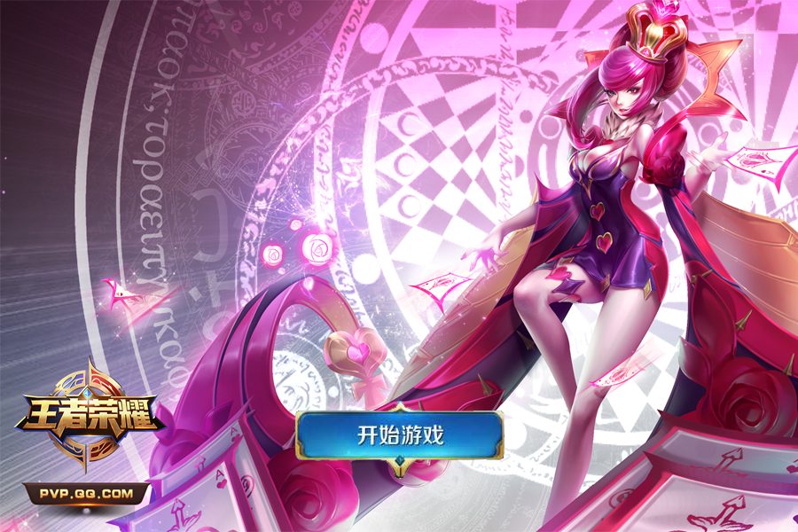
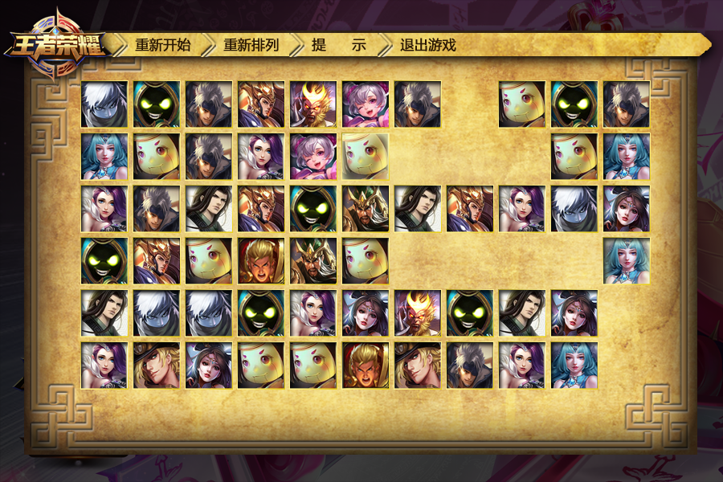
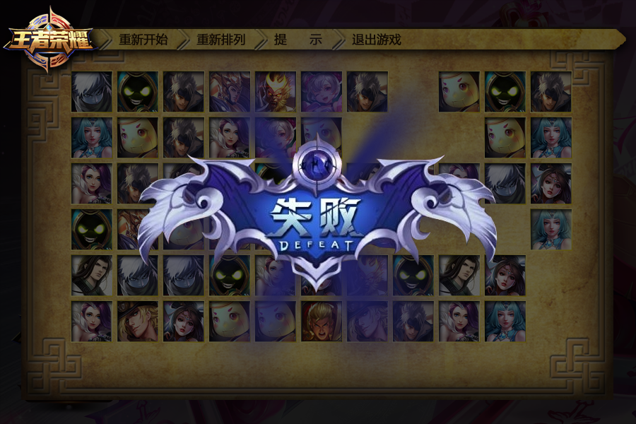
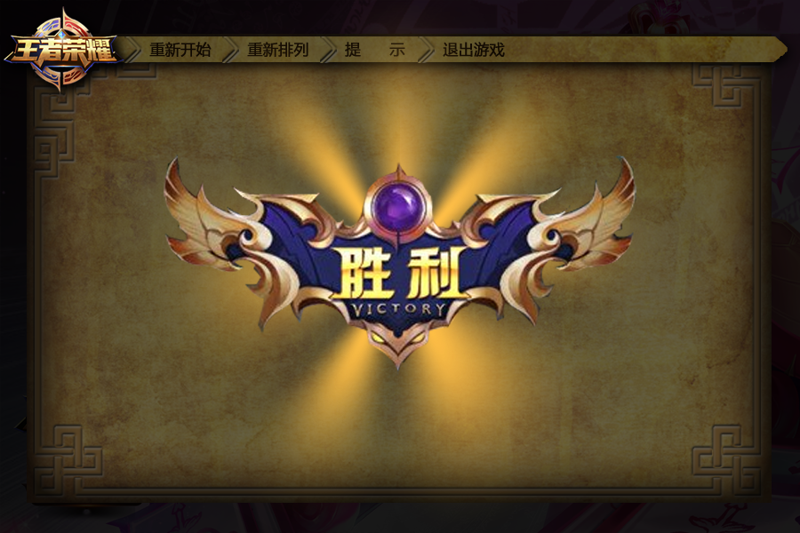

## 名称:
- PictureMatching

## 软件简介
- 一个王者荣耀风格的连连看游戏，实现了连连看的基本算法和功能。超过十秒没有消除就会游戏失败。全部消除游戏成功。提供重新开始、重新排列、提示（会直接消除两个方块）退出游戏的功能。

## 说明:
- 开发平台: Windows 7 X64.
- 开发环境: Qt 5.7
- 游戏中所有的代码以及资源文件均已开源，可自行下载，欢迎更多的学习交流。

## 用法:
- 使用Qt打开项目.pro文件，编译运行。

## 项目截图：

## 开源协议:
- 雪碧软件协议
